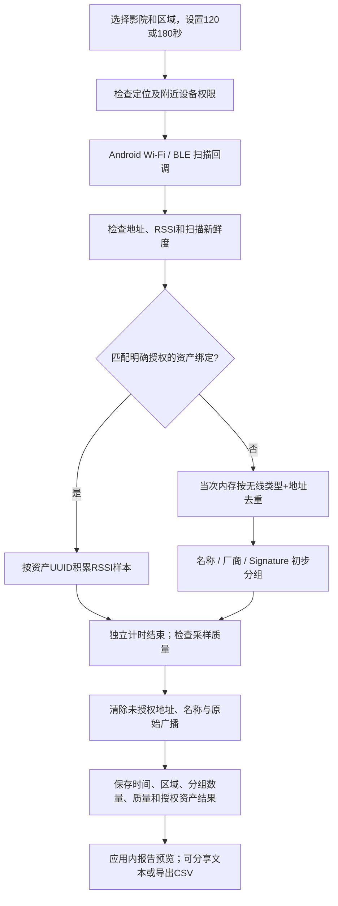

# CinemaWatch 信号检测逻辑（0.3.0）

## 先理解你看到的数字

Wi-Fi 的 48 表示**本次采样接收过的、未登记的 48 个 AP／热点无线地址**，不是 48 台手机或 48 个人。Android 普通 Wi-Fi 扫描主要发现 AP／热点，通常看不到仅连接到 AP 的手机。一个路由器可以广播多个 SSID/BSSID。

BLE 的 122 表示**本次采样接收过的、未登记的 122 个 BLE 广播地址**。广播可能来自手机、耳机、手表、传感器等；地址随机化也可能让一个物理设备在同一次巡检出现多个地址。Wi-Fi 与 BLE 之间不自动合并身份，不能相加为设备数或人数。

17/19/48、54/56/122 这样的变化可能来自扫描批次、系统节流、无线开启状态、广播周期、人员移动、墙体遮挡或随机地址。不能只凭这些变化推断观众进出；当前软件没有人数估计模型。

## 从扫描到报告

### 1. 开始一次采样

选择区域，设置 120 或 180 秒。演示模式用 15 秒合成数据，不扫描现场，也不建立设备基准。

读取 Android 需要的定位／附近设备权限，并检查系统定位开关。定位权限是 Android 获取 Wi-Fi 扫描的要求；应用不记录 GPS 坐标。从 0.3 起应用仅在手动检查／下载更新时联网，不上传检测数据；不使用云 LLM，不主动登录 AP、配对 BLE 或读取手机内容。

### 2. 接收 Wi-Fi 与 BLE

- Wi-Fi：复用固定 Fieldwatch 的 `WifiRadio`、信息元素解析。请求扫描间隔至少约 30 秒；上游还遵守 Android 常见的前台每 2 分钟 4 次请求配额。系统可以拒绝或节流请求，后台、厂商省电策略也会影响结果。
- BLE：复用 `BleRadio` 与广播解析，以 balanced 模式接收广播；扫描失败按照上游策略退避重试。BLE 通常是事件流，不等同于 Wi-Fi 的扫描批次。
- 观察先进入最多 512 条的队列。UI 最多展示 512 个不同信号；会话内未登记地址去重最多 4096 项。达到容量或有积压丢弃时标记结果不完整。

### 3. 去掉无效、缓存与重复结果

RSSI 只接受 -120 至 -1 dBm。零、正数或哨兵值不会当作有效证据。地址需符合 6 字节格式；全零、全 FF 和系统占位地址剔除。仅 Wi-Fi 检查单播位，BLE 地址不能套用 Wi-Fi 的组播位规则，避免误丢有效蓝牙广播。

Wi-Fi 还要求上游标记为新鲜，并验证系统结果的微秒时间戳：不早于本次开始，且距当前单调时间不超过 15 秒。同一批时间戳重复到达不会重复增加“新鲜批次”。缓存被剔除是预期行为，并不等于用户必须修理 Wi-Fi。

同一次巡检里，相同“无线类型＋地址”只增加一次未登记数量；重复广播更新 RSSI 与最近时间。结束后全部清除，不保留跨日对照键。

### 4. 先查授权资产，再做初步分组

资产使用随机 UUID，MAC 只是用户明确授权的绑定线索。一个资产可以绑定 Wi-Fi 和 BLE 两种地址。已登记的地址不计入未登记分组；其他区域的已登记资产也不混入未登记统计。

分组不是自动资产登记，更不能证明设备属于影院。当前分组规则如下：

| 显示类别 | 主要依据 | 可以得出的结论及限制 |
|---|---|---|
| 可能是 iPhone | 广播名称明确含 iPhone | 低置信；名称可伪装，Wi-Fi 也可能只是热点名称 |
| Apple 设备，型号未知 | BLE 公司标识或可用 OUI | 中置信厂商线索；也可能是 Mac、耳机、手表，不能直接认定 iPhone |
| 华为／荣耀、小米生态设备 | 公司标识、OUI；或名称线索 | 公司/OUI 为中置信，名称为低置信；也可能是路由器或 IoT，不等于手机 |
| 可能是电脑 | MacBook、ThinkPad、DESKTOP 等广播名称 | 低置信，只是名称线索 |
| 可能是手机／音频／可穿戴／IoT | 固定上游 Signature 规则 | 低置信；规则可能包含名称条件，需要核实 |
| 路由器／AP／热点 | Wi-Fi 广播角色、没有更具体线索 | 可以说它是 AP／热点信号，不能区分路由器与手机热点 |
| 无法判断 | 没有足够线索 | 保留未知，不编造品牌或型号 |

厂商查询使用本地 IEEE OUI 与 Bluetooth SIG 公司表。BLE 仅在系统明确提供 Public 地址类型时查询 OUI；随机或类型未知时只用广播公司代码等证据。Android 15 以下上游无法获得地址类型，不能凭地址某一位断言为公共地址。Wi-Fi 的局部地址处理保留上游对虚拟 AP 的规则与限制。判断只依赖广播证据，广播字段本身也可能伪造。

**分组数量表示未登记无线地址数，不是已经识别的物理设备数。** 一个地址在会话内以最后一次有效观察的预判类别计入一个组；报告分别列出 Wi-Fi/BLE 来源，不把它们相加。只保存类别、来源、数量，不保存未授权名称、MAC 或原始载荷。旧报告没有这些数据，不能事后反推出品牌。

### 5. 时间与采样质量

0.2.0 将停止计时与 BLE 重启退避分开，Signature 匹配移到后台计算；已经判断为未知的信号不会每个包重复跑整个规则库。Wi-Fi 时间戳查询有短时缓存，减少主线程工作。

前台采样使用有超时的 CPU 唤醒锁，采样结束释放；它不要求屏幕常亮。目标时间过后不继续接受观察。实际时长必须在“目标～目标＋5 秒”内、且没有队列丢弃，才能视为完整。

- Wi-Fi 健康：完整采样且至少 2 个不同的新鲜批次。
- BLE 健康：完整采样、无未恢复错误、至少 10 条有效广播，事件跨度覆盖至少一半目标时间，最后 15 秒仍有有效广播。短时间突发或后半段沉默不会证明扫描覆盖充分。
- 这是工程质量门槛，仍不能证明全影厅无死角。来源不健康时，资产显示数据不足，不增加连续缺失次数。

你截图中 434 秒的旧记录会显示超时提醒，建议重测。旧版没有保存目标时长；0.2.0 以后明确保存并展示目标／实际时长。旧数据缺少的信息不会伪造补齐。

### 6. 资产 RSSI 状态

只对明确授权、已有无线绑定的资产比较：

- 前 3 次有效读数用于采集参考基准；下一次开始使用最多最近 5 个健康巡检中位数的中位数作为基准。
- RSSI 比基准弱至少 12 dBm：提示偏弱。
- 有至少 5 个有效样本且最大／最小差至少 18 dBm：提示不稳。
- 完整健康巡检第一次未见：需要复查；连续第二次健康未见：提示连续未见。
- 无绑定、来源不健康、超时或丢弃：不据此认定设备丢失。
- RSSI 受遮挡、反射、朝向和设备功率影响，不能换算成可靠距离。寻信号仅显示相对趋势，超过 15 秒没有新观察就不使用旧信号显示趋势。

新增绑定会立即更新当前信号标签与计数；开始时没有纳入的资产从下一次完整巡检开始做结果判定，避免用半次巡检建立基准。

## 为什么之前三次巡检仍不能创建资产

0.1.0 只有“扫描期间点信号登记”路径；资产页没有独立创建按钮，结束后原始信号已清除。巡检次数不会自动生成资产。

0.2.0 增加：资产页直接创建 → 可先不填地址 → 之后手动绑定或在扫描中绑定到已有资产。创建和绑定都要求明确确认授权。无效地址、重复绑定、数据库保存失败分别提示，失败事务不会留下没有正确绑定的幽灵资产。

## 数据、导入与升级

数据库保存影院、区域、明确授权的资产与绑定、汇总会话、授权结果和分类计数。数据库 v1→v2 提供非破坏迁移，保留原有数据；不会用清空数据库解决升级。

旧预览使用一次性调试签名，无法可靠覆盖安装。0.2.0 使用独立预览应用 ID，与 0.1.0 共存：先在旧版导出 CSV，在新版设置中导入。只导入汇总历史并标注“导入”，不从资产名字重建身份/无线绑定，也不把导入记录当校准样本。重复会话跳过，超大或损坏文件整批拒绝，不产生部分导入。

固定上游仍是 Fieldwatch v1.1.21 / `5379a2049c351c2483f7f106ca68d5d6d5f00e64`。MIT、署名和查表条款保留。正式版本下一步需要稳定签名以及影院真机覆盖／节流／省电策略验证。

0.3 已恢复原包名和固定签名，后续更新保留数据；旧临时签名需要用户已接受的一次性换装，详见 [覆盖升级与签名](UPDATES_AND_SIGNING.md)。
